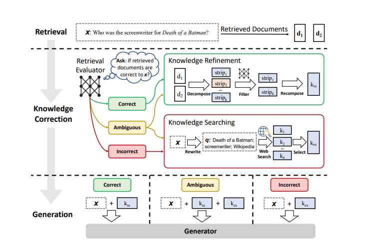

# Corrective RAG (CRAG) — Step-by-Step Implementation

A progressive, 6-notebook series implementing the **Corrective Retrieval-Augmented Generation (CRAG)** paper from scratch using LangChain and LangGraph.

> **Paper:** [Corrective Retrieval Augmented Generation — arXiv 2401.15884](https://arxiv.org/abs/2401.15884)

---

## What is CRAG?

Standard RAG pipelines retrieve documents and pass them directly to the LLM — regardless of whether those documents are actually relevant. **CRAG** adds a self-corrective layer: it evaluates the quality of retrieved documents, and if they're not good enough, it refines the query and supplements retrieval with a web search before generating a response.



---

## Notebook Series

Each notebook is self-contained and builds on the previous one by adding a new capability to the pipeline.

| # | Notebook | Concept |
|---|----------|---------|
| 1 | [`1_basic_rag.ipynb`](1_basic_rag.ipynb) | Baseline RAG with FAISS vector store |
| 2 | [`2_retrieval_refinement.ipynb`](2_retrieval_refinement.ipynb) | Sentence-level relevance filtering |
| 3 | [`3_retrieval_evaluator.ipynb`](3_retrieval_evaluator.ipynb) | Per-document relevance scoring with LangGraph |
| 4 | [`4_web_search_refinement.ipynb`](4_web_search_refinement.ipynb) | Web search fallback via Tavily |
| 5 | [`5_query_rewrite.ipynb`](5_query_rewrite.ipynb) | Query rewriting for better semantic retrieval |
| 6 | [`6_ambiguous.ipynb`](6_ambiguous.ipynb) | Detecting and resolving ambiguous queries |

---

## Detailed Breakdown

### 1. Basic RAG
Foundational pipeline: load PDFs → chunk → embed (OpenAI) → store in FAISS → retrieve → generate with GPT.  
Establishes the baseline that all subsequent notebooks improve upon.

### 2. Retrieval Refinement
Decomposes each retrieved document into individual sentences, evaluates each sentence's relevance independently using an LLM, and drops irrelevant ones before generation.  
Uses a `KeepOrDrop` Pydantic model for structured classification.

### 3. Retrieval Evaluator
Moves from sentence-level to document-level evaluation. Assigns a relevance score (`DocEvalScore`) to each retrieved document using a LangGraph state graph.  
Low-scoring documents are flagged for replacement rather than included in the prompt.

### 4. Web Search Refinement
When document scores fall below the threshold, the pipeline automatically falls back to **Tavily web search** to supplement or replace local retrieval.  
Introduces a conditional edge in the LangGraph workflow.

### 5. Query Rewrite
Before triggering web search, the pipeline rewrites the original user query to improve semantic alignment with relevant documents.  
Demonstrates how query transformation can recover failed retrievals without external search.

### 6. Ambiguous Queries
Handles the real-world case where a user query is unclear or has multiple interpretations. The pipeline detects ambiguity, resolves intent, then proceeds with the appropriate retrieval strategy.

---

## Tech Stack

| Component | Library |
|-----------|---------|
| LLM | OpenAI GPT-4o |
| Embeddings | OpenAI `text-embedding-3-small` |
| Vector Store | FAISS (local, in-memory) |
| Workflow Orchestration | LangGraph |
| Web Search | Tavily Search API |
| Data Validation | Pydantic v2 |
| Document Loading | LangChain `PyPDFLoader` |

---

## Setup

### 1. Install Dependencies

```bash
pip install langchain langchain-community langchain-openai langgraph faiss-cpu \
            tavily-python pydantic pypdf python-dotenv
```

### 2. Set API Keys

Create a `.env` file in this folder:

```env
OPENAI_API_KEY=your_openai_api_key
TAVILY_API_KEY=your_tavily_api_key     # required from notebook 4 onwards
```

### 3. Sample Documents

The `documents/` folder contains sample PDFs used across all notebooks. You can replace them with your own.

```
documents/
├── book1.pdf
├── book2.pdf
└── book3.pdf
```

### 4. Run

Open any notebook in Jupyter and run all cells top to bottom.

```bash
jupyter notebook 1_basic_rag.ipynb
```

---

## CRAG Pipeline Flow

```
User Query
    │
    ▼
[Retrieve] → FAISS local search
    │
    ▼
[Evaluate] → Score each document (Correct / Ambiguous / Incorrect)
    │
    ├─ Correct ──────────────────────────────► [Generate] → Response
    │
    ├─ Ambiguous → [Refine] → Re-retrieve ──► [Generate] → Response
    │
    └─ Incorrect → [Rewrite Query]
                       │
                       ▼
                [Web Search (Tavily)]
                       │
                       ▼
                  [Generate] → Response
```

---

## Reference

- [CRAG Paper (arXiv 2401.15884)](https://arxiv.org/abs/2401.15884)
- [LangGraph Docs](https://langchain-ai.github.io/langgraph/)
- [Tavily Search API](https://tavily.com/)
