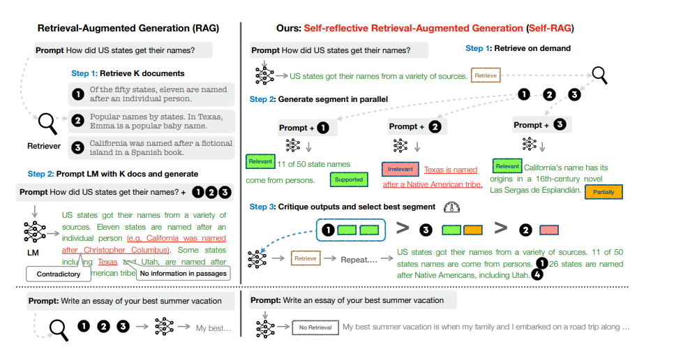

# Self-RAG — Step-by-Step Implementation

**A progressive, 8-notebook series building a full Self-Reflective Retrieval-Augmented Generation (Self-RAG) system using LangChain, LangGraph, and OpenAI.**

---

## What is Self-RAG?

Self-RAG ([arXiv 2310.11511](https://arxiv.org/abs/2310.11511)) is a framework that teaches a language model to **reflect on its own retrieval and generation decisions** using four special critique signals:

| Signal | Question asked | Possible values |
|--------|---------------|-----------------|
| **Retrieve** | Does this question need external documents at all? | `yes` / `no` |
| **IsREL** | Is each retrieved document relevant to the question? | `relevant` / `irrelevant` |
| **IsSUP** | Is the generated answer supported by the retrieved context? | `fully_supported` / `partially_supported` / `no_support` |
| **IsUSE** | Is the final answer useful / responsive to the user's question? | `useful` / `not_useful` |

Rather than always retrieving, Self-RAG retrieves **on demand**, filters documents, and **self-critiques** its answers — revising or re-querying until the output meets quality thresholds.



---

## Repository Structure

```
self-rag/
│
├── README.md
├── self-rag paper.pdf              # Original Self-RAG research paper
├── self-rag.png                    # Architecture diagram
│
├── documents/                      # Sample PDFs used across all notebooks
│   ├── Company_Policies.pdf        # NexaAI internal policies
│   ├── Company_Profile.pdf         # NexaAI company profile
│   └── Product_and_Pricing.pdf     # NexaAI products and pricing
│
├── self_rag_step1.ipynb            # Step 1: Adaptive retrieval decision
├── self_rag_step2.ipynb            # Step 2: Document relevance filtering (IsREL)
├── self_rag_step3.ipynb            # Step 3: Context-grounded generation
├── self_rag_step4.ipynb            # Step 4: Answer support verification (IsSUP)
├── self_rag_step5.ipynb            # Step 5: Retry limit & loop control
├── self_rag_step6.ipynb            # Step 6: Usefulness evaluation (IsUSE)
├── self_rag_step7.ipynb            # Step 7: Query rewriting — complete Self-RAG
└── self_rag_web.ipynb              # Bonus: Web search variant
```

---

## Progressive Build — Step by Step

Each notebook adds exactly **one new Self-RAG capability** to the LangGraph pipeline. By the end of step 7 you have a complete, production-ready Self-RAG graph.

### Step 1 — Adaptive Retrieval Decision (`Retrieve` token)

`self_rag_step1.ipynb`

The first reflection signal: **should the system retrieve at all?**

A structured LLM call (`RetrieveDecision`) decides whether the question requires external documents or can be answered directly from the model's parametric knowledge.

**Graph nodes added:**
- `decide_retrieval` — routes to `generate_direct` or `retrieve`
- `generate_direct` — answers from model knowledge (no docs needed)
- `retrieve` — FAISS similarity search over the PDF corpus

**State fields:** `question`, `need_retrieval`, `docs`, `answer`

```
START → decide_retrieval → generate_direct → END
                        ↘ retrieve → [generation TBD] → END
```

---

### Step 2 — Document Relevance Filtering (`IsREL` token)

`self_rag_step2.ipynb`

Adds per-document relevance checking after retrieval. Each document is judged independently against the question using a `RelevanceDecision` structured output.

**Graph nodes added:**
- `is_relevant` — filters retrieved docs, keeping only those marked relevant

**State fields added:** `relevant_docs`

```
retrieve → is_relevant → [generation TBD]
```

---

### Step 3 — Context-Grounded Generation

`self_rag_step3.ipynb`

Wires up the actual generation step after relevance filtering. If no relevant documents survive the filter, the system returns a graceful "no relevant document found" message rather than hallucinating.

**Graph nodes added:**
- `generate_from_context` — generates an answer grounded strictly in relevant docs
- `no_relevant_docs` — fallback when all docs are filtered out

**State fields added:** `context`

```
is_relevant → generate_from_context → END
           ↘ no_relevant_docs → END
```

---

### Step 4 — Answer Support Verification (`IsSUP` token)

`self_rag_step4.ipynb`

The second major critique signal: **is the generated answer supported by the retrieved context?**

An `IsSUPDecision` structured output classifies the answer as `fully_supported`, `partially_supported`, or `no_support`. Unsupported or partially supported answers trigger a **revise loop**.

**Graph nodes added:**
- `is_sup` — classifies support level
- `accept_answer` — passes through fully supported answers
- `revise_answer` — rewrites the answer to stay within supported facts

**Routing logic:** `fully_supported` → END; `partially_supported` / `no_support` → revise → is_sup (loop)

```
generate_from_context → is_sup → accept_answer → END
                              ↘ revise_answer ↗  (loop)
```

---

### Step 5 — Retry Limit & Loop Control

`self_rag_step5.ipynb`

Prevents the IsSUP revise loop from running indefinitely. Adds a `retries` counter to state, capping the revision cycle at a configurable maximum (default: 3).

**State fields added:** `retries`

**What changed:** `route_after_issup` now checks `state["retries"]` and exits after the limit, returning the best available answer.

---

### Step 6 — Usefulness Evaluation (`IsUSE` token)

`self_rag_step6.ipynb`

Adds the third critique signal: **is the final answer actually useful to the user?**

Even a factually supported answer may be evasive, incomplete, or not address what was asked. `IsUSEDecision` detects this with a `useful` / `not_useful` verdict.

**Graph nodes added:**
- `is_use` — evaluates whether the accepted answer satisfies the user's intent
- Routes to END if useful, or triggers re-retrieval if not useful

**State fields added:** `isuse`

```
accept_answer → is_use → END          (if useful)
                      ↘ [re-retrieve] (if not_useful)
```

---

### Step 7 — Query Rewriting — Complete Self-RAG

`self_rag_step7.ipynb` — **the complete Self-RAG implementation**

Closes the loop: when an answer is judged `not_useful`, rather than simply re-retrieving with the same query, the system **rewrites the question** to improve retrieval quality on the next attempt.

**Graph nodes added:**
- `rewrite_question` — uses `RewriteDecision` to generate a semantically improved version of the original query, then loops back to `retrieve`

**Full pipeline:**

```
START
  └─► decide_retrieval
           │
           ├─► generate_direct ────────────────────────────────► END
           │
           └─► retrieve
                  └─► is_relevant
                           │
                           ├─► no_answer_found ───────────────► END
                           │
                           └─► generate_from_context
                                      └─► is_sup
                                               │
                                               ├─► accept_answer
                                               │        └─► is_use
                                               │                 │
                                               │                 ├─► END (useful)
                                               │                 └─► rewrite_question
                                               │                             └──────────► retrieve (loop)
                                               └─► revise_answer ──────────► is_sup (loop)
```

---

### Bonus — Web Search Variant

`self_rag_web.ipynb`

A variant of the Self-RAG pipeline that replaces FAISS local retrieval with **live web search**. When the question requires current or external knowledge, the system:

1. Decides retrieval need (same as Step 1)
2. Rewrites the question into an optimized web search query (`WebQuery`)
3. Executes the web search and filters results by relevance
4. Generates a grounded answer from web results

**New components:** `WebQuery` structured output, `rewrite_query_node`, `web_search_node`

---

## Concept Summary

| Step | Notebook | Concept | Self-RAG Token |
|------|----------|---------|---------------|
| 1 | `step1` | Decide whether retrieval is needed | `Retrieve` |
| 2 | `step2` | Filter retrieved docs by relevance | `IsREL` |
| 3 | `step3` | Generate answer from relevant context | — |
| 4 | `step4` | Verify answer is supported by context | `IsSUP` |
| 5 | `step5` | Cap revision loops with retry limit | — |
| 6 | `step6` | Evaluate if the answer is useful | `IsUSE` |
| 7 | `step7` | Rewrite query when answer fails | — |
| Bonus | `web` | Replace FAISS with live web search | all |

---

## Tech Stack

| Category | Tool |
|----------|------|
| LLM | OpenAI `gpt-4o-mini` |
| Embeddings | OpenAI `text-embedding-3-large` |
| Vector Store | FAISS (in-memory) |
| Orchestration | LangGraph `StateGraph` |
| LLM Framework | LangChain |
| Structured Output | Pydantic `BaseModel` + `with_structured_output` |
| Document Loading | `PyPDFLoader` |
| Text Splitting | `RecursiveCharacterTextSplitter` (chunk=600, overlap=150) |

---

## Getting Started

### Prerequisites

- Python 3.10+
- Jupyter Notebook or JupyterLab
- OpenAI API key

### Installation

```bash
# From the RAGCraft root
pip install -r requirements.txt

# Or install individually
pip install langchain langchain-community langchain-openai langgraph faiss-cpu pydantic pypdf python-dotenv
```

### Environment Setup

Create a `.env` file in `self-rag/` (or the project root):

```env
OPENAI_API_KEY=your_openai_key

# Only needed for self_rag_web.ipynb
TAVILY_API_KEY=your_tavily_key
```

### Running the Notebooks

Open notebooks in order, starting from Step 1:

```bash
cd self-rag
jupyter notebook self_rag_step1.ipynb
```

Each notebook is **self-contained** — it re-imports all dependencies and rebuilds the full graph, so you can run any step independently without running prior steps first.

---

## Sample Documents

The `documents/` folder contains three fictional company PDFs for a company called **NexaAI**:

| Document | Contents |
|----------|----------|
| `Company_Policies.pdf` | HR policies, refund policy, leave policy, conduct guidelines |
| `Company_Profile.pdf` | Company overview, leadership team, culture, employee count |
| `Product_and_Pricing.pdf` | Product catalog, pricing tiers, free trial details |

Sample queries used across the notebooks:
- *"What is Machine Learning?"* — triggers `generate_direct` (no retrieval needed)
- *"Who is the CEO of NexaAI?"* — triggers retrieval from Company_Profile
- *"Do NexaAI plans include a free trial? If yes, how many days?"* — tests IsSUP
- *"What is the refund policy of NexaAI?"* — tests IsUSE + rewrite loop
- *"Describe NexaAI's company culture."* — tests relevance filtering

---

## Reference

- [Self-RAG: Learning to Retrieve, Generate, and Critique through Self-Reflection — arXiv 2310.11511](https://arxiv.org/abs/2310.11511)
- [LangGraph Documentation](https://langchain-ai.github.io/langgraph/)
- [LangChain Structured Output](https://python.langchain.com/docs/how_to/structured_output/)
